## Recuperando câmera CFTV

Olá!

Na última semana tive uma dificuldade com duas câmeras Intelbras VIP-3220-B que brickaram, simplesmente do nada. Apesar de existirem milhares de posts e vídeos no YouTube de pessoas ensinando a configurar, resetar, alterar senha e et, não encontrei nenhuma informação a respeito de como tentar recuperar o equipamento nestes casos. Vou fazer um passo-a-passo aqui de como detectei que a câmera não estava condenada e comecei os trabalhos para recuperá-las.

Vou assumir que você já está habituado(a) com pelo menos o comportamento básico de redes, CFTV e um pouco de eletrônica.

### Diagnóstico

Percebi que as câmeras haviam parado de gravar e então removi-as do local para dar uma olhada mais de perto, já esperando que estivessem queimadas. Conectei-as à energia e conectei no meu roteador. Percebi então que a interface de rede do roteador ficava ligando e desligando após alguns segundos. Achei curioso e isso me fez ter esperança, pois imaginei que ainda havia algo vivo que estivesse gerando reboot do equipamento. Pra tentar disgnosticar o que estava ocorrendo, conectei a câmera direto no meu laptop e usei o Wireshark para capturar o tráfego de rede e então tentar ter alguma pista do motivo do comportamento.
Na imagem abaixo, algumas pistas aparecem:

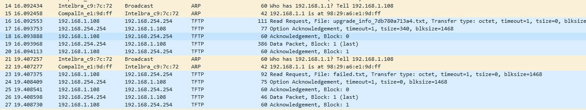

1) O pacote 14 mostra que a câmera está procurando o endereço de gateway 192.168.1.1 e mandando informar ao 192.168.1.108, que é o endereço que a própria câmera atribuiu a si mesma. Sabendo disso, atribuí o endereço 192.168.1.1 na interface de rede do laptop.
2) O pacote 16 mostra que ela, então, via TFTP, tenta baixar o arquivo *upgrade_info_7db780a7134a.txt*, do servidor 192.168.254.254. Sabendo disso, adicionei (também) o endereço 192.168.254.254 na interface de rede do laptop.
3) Não conseguindo encontrar o arquivo procurado, tenta baixar o arquivo *failed.txt*.

Este comportamento é bastante comum quando um equipamento não encontra o sistema operacional e tenta efetuar o boot via rede, usando TFTP. Comecei a pensar que talvez o armazenamento delas estivesse queimado ou com problemas. Comecei a pesquisa procurando por informações do arquivo *upgrade_info_7db780a7134a.txt*. A partir daí, tudo começou a se esclarecer, pois há bastante conteúdo disponível quando pesquisamos sobre o arquivo acima. Aparentemente, a Intelbras usa o mesmo equipamento (se não o mesmo equipamento, então o mesmo bootloader) que uma outra fabricante chinesa chamada Dahua.

### Partindo pra recuperação

Navegando em vários fóruns, encontrei alguns que disponibilizavam o procedimento para conseguir fazer a instalação manual do firmware através da porta serial da câmera. Abri, então, uma delas e consegui encontrar as portas para acesso, conforme indicado [neste link](https://www.cctvforum.com/topic/41307-unbricking-your-dahua-ip-camera-tips-tricks-amp-firmware/). Segue abaixo uma foto com as portas identificadas:

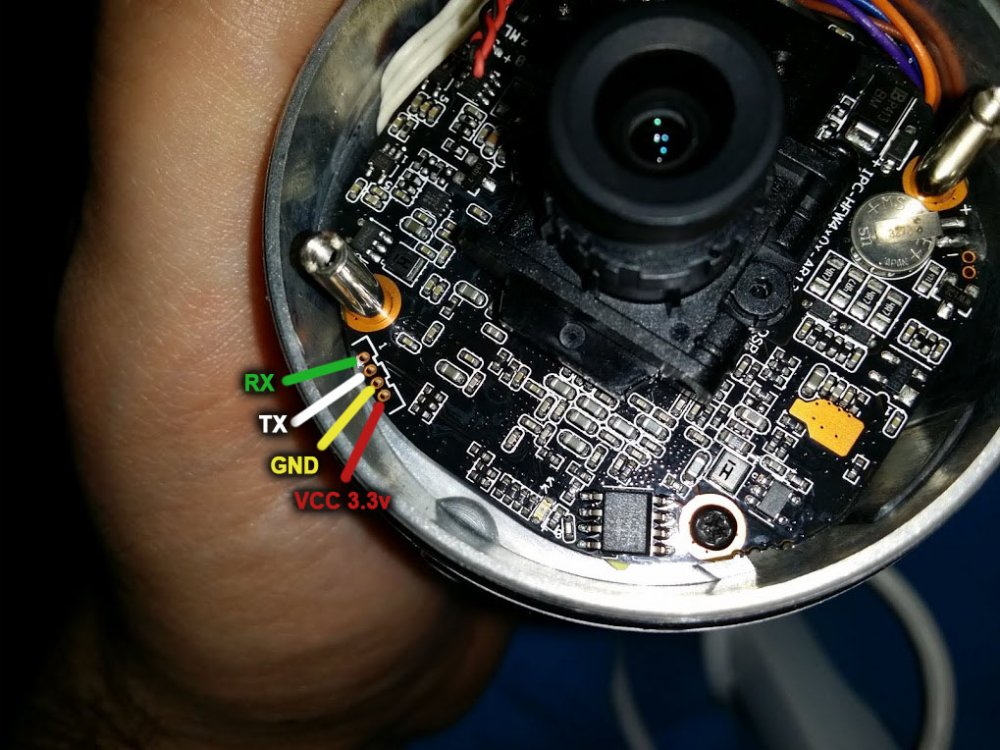

Segui então para a conexão com a serial para ver o que conseguia capturar na console delas. Usei um adaptador USB que possuo e fiz as conexões da seguinte forma, usando uma protoboard:

Adaptador | Câmera
--------- | ------
3.3v | 3.3v
TX | RX
RX | TX
GND | GND

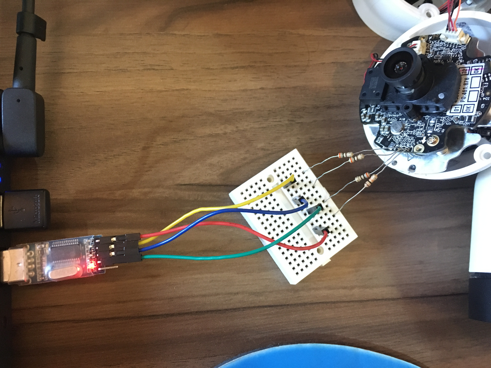

Feito isso, consegui acesso à serial. Porém, na maioria dos posts que encontrei, o pessoal fazia a flash do novo firmware manualmente, através da linha de comando da serial. Desocbri,então, que para ter acesso a isso, você precisa interromper o processo pressionando qualquer tecla. Como o tempo para interormper é de aproximadamente 1 segundo, sugiro ficar pressionando-o com uma frequência alta até que tenha acesso à shell do bootloader. Leva uns 2~3 boots até ter sucesso, mas funciona.

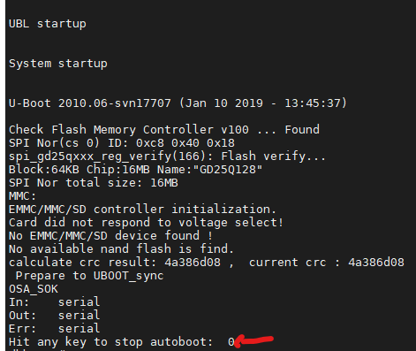

Uma vez interrompido o boot, você pode pedir para imprimir todas as variáveis em tela com o comando *printenv*:

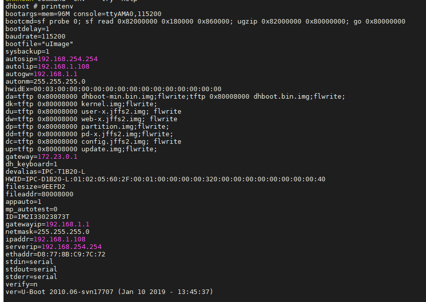

Com esse comando, podemos ver as configurações com as quais o bootloader se configura quando inicia o processo de boot. Se você quiser, pode imprimir todos os comandos disponíveis usando *help*:

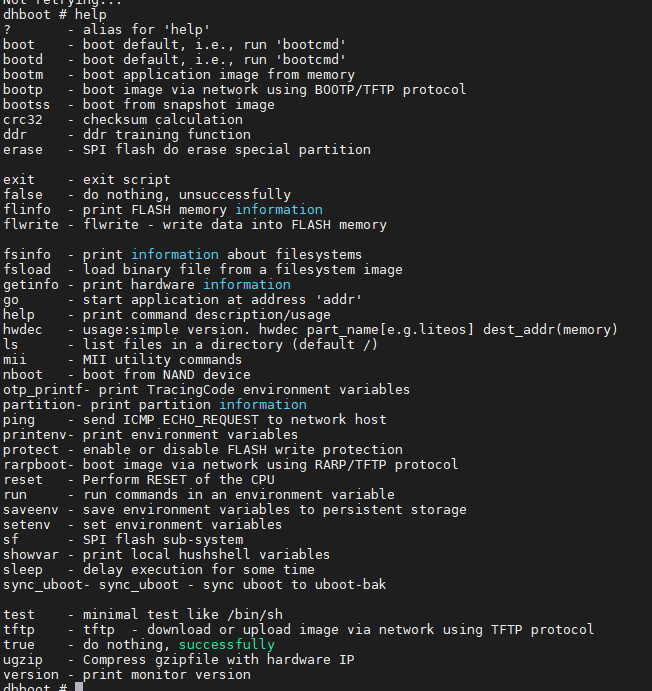

O importante aqui é a informação sobre os arquivos que o bootloader usa para instalar o sistema operacional. Esses dados são as das variáveis abaixo:

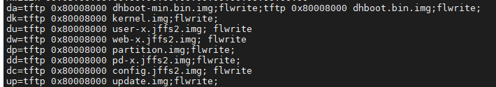

Todos esses arquivos .img estão contidos no arquivo de instalação do firmware, comprimidos em um arquivo.bin. Para conseguí-los (pelo menos a maioria deles), baixei a versão de firmware direto do site da Intelbras, e depois descompactei. Você verá que boa parte dos arquivos desejados estarão disponíveis. 
Agora que consegui os arquivos, é necessáro encontrar uma forma de disponibilizá-los para que o bootloader possa baixá-los para instalação via TFTP. Para isso, usei o TFTPD32. Você pode pesquisar e baixar de onde preferir. Na minha configuração, eu preferi colocar o endereço 192.168.254.254 na minha placa de rede porque achei que sairia mais barato. Porém, é possível alterar os endereços conforme quiser usando o comando *setenv*.

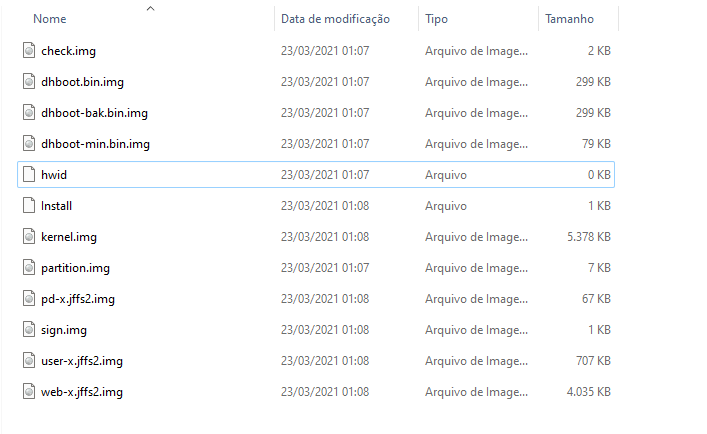

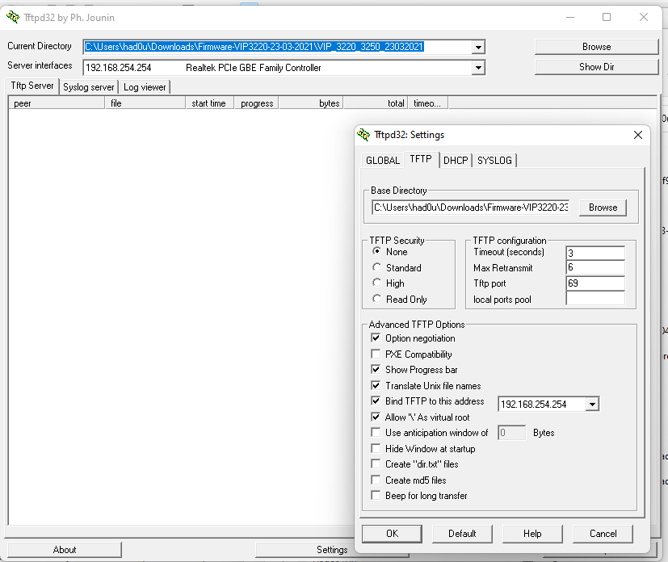

Depois de configurado o TFTP e a sua placa de rede, testei a conectividade usando o comando *ping*:

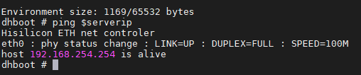

Com o TFTP configurado e conectividade ok, podemos iniciar o processo de boot, usando o comando *run* e a variável do arquivo .img que se quer instalar. Por exemplo:

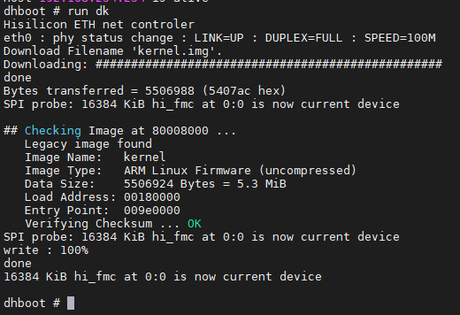

Feito isso, executa-se o mesmo processo para todos os arquivos (dk, du, dw, dp, dd, dc, up), **MENOS PARA O BOOTLOADER**! A não ser que voce realmente precise, não há razão para atualizá-lo. No meu caso, as duas últimas não funcionaram, mas nem sei se eram necessários. De qualquer forma, minha intenção era que o básico da câmera subisse para que eu pudesse fazer uma atualização de firmware do modelo tradicional e recuperar todas as funções. Executados todos os comandos, podemos pedir o reboot do equipamento com o comando *boot*.
Se você obteve sucesso na atualização, perceberá na serial a diferença, pois comecçará a ver a saída de todas as ações do sistema operacional.

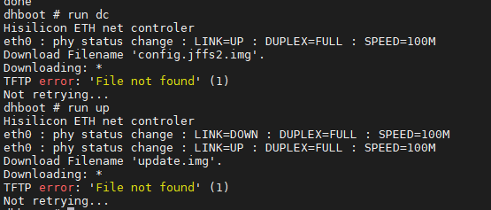

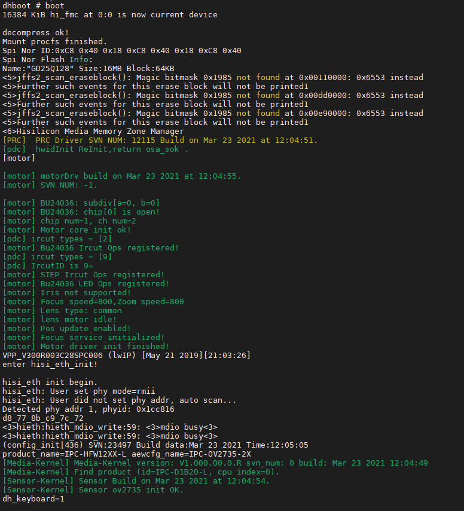

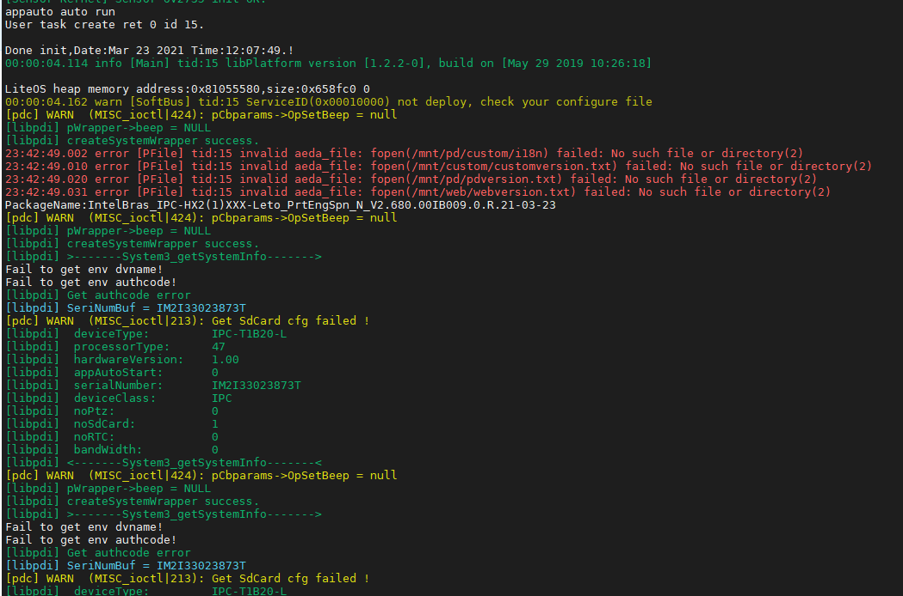

Successo! Inclusive, como estava em uso, a câmera voltou com as mesmas configurações, como IP, senha e etc. Caso não aconteça com vocÊ, é possível saber o endereço dela usando o Wireshark ou o aplicativo IP Utility, da própria Intelbras.

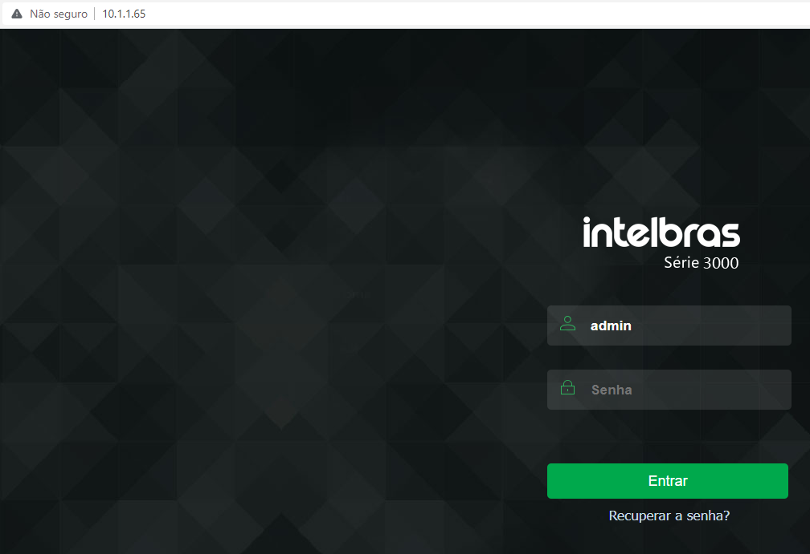

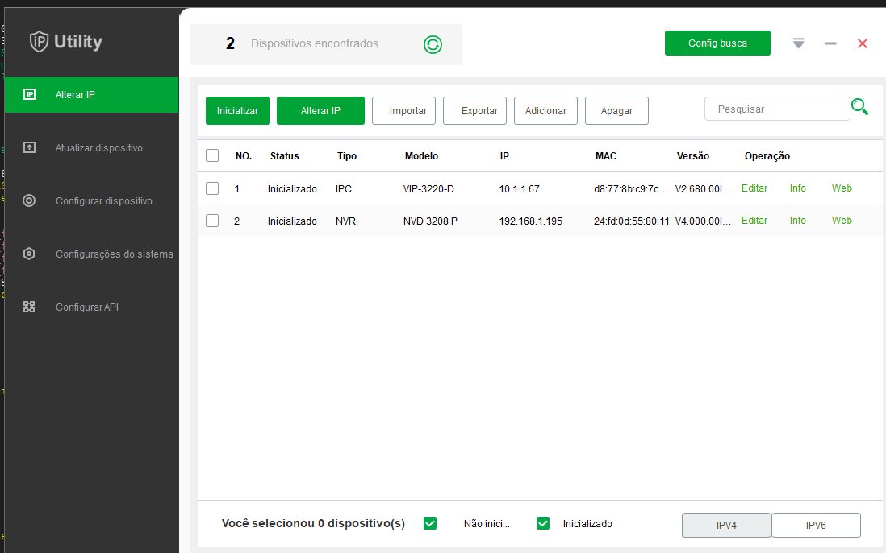

Feito isso, fiz uma atualização comum, apontando o arquivo .bin que o próprio fabricante disponibiliza. Assim, tive certeza que a câmera estava configurada com tudo que precisava.

Espero que este post ajude aos colegas que, eventualmente, sofrerem com o mesmo problema.